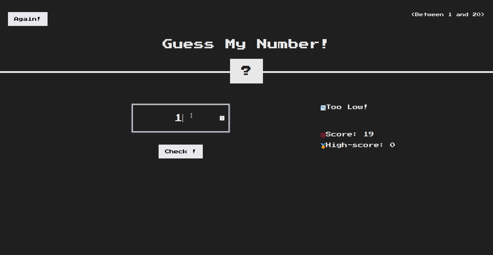
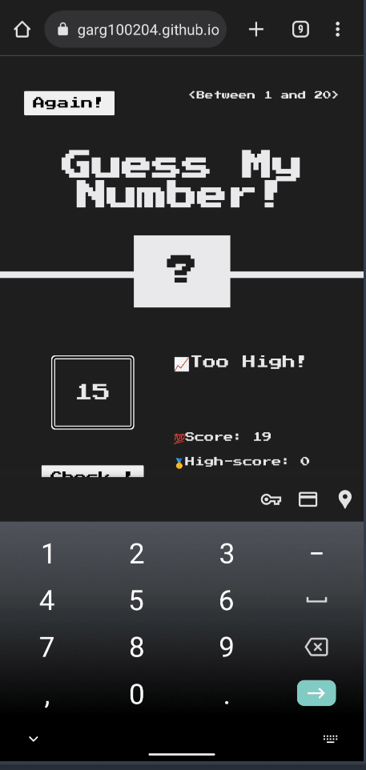

<!-- Improved compatibility of back to top link: See: https://github.com/othneildrew/Best-README-Template/pull/73 -->

<!-- PROJECT SHIELDS -->

[![Stargazers][stars-shield]][stars-url]
[![MIT License][license-shield]][license-url]
[![LinkedIn][linkedin-shield]][linkedin-url]

<!-- PROJECT LOGO -->
 

  

<h3 align="center">GuessMaster</h3>

  

    Engage in a thrilling guessing game at GuessMaster, where you compete to guess a random number with the fewest tries and claim the top spot!
     
    <a href="https://github.com/ujjwalgarg100204/Vanilla-JS-Guess-My-Number"><strong>Explore the docs »</strong></a>
     
     
    <a href="https://ujjwalgarg100204.github.io/Vanilla-JS-Guess-My-Number">View Demo</a>
    ·
    <a href="https://github.com/ujjwalgarg100204/Vanilla-JS-Guess-My-Number/issues">Report Bug</a>
    ·
    <a href="https://github.com/ujjwalgarg100204/Vanilla-JS-Guess-My-Number/issues">Request Feature</a>
  

<!-- TABLE OF CONTENTS -->

  
Table of Contents

  <ol>
    <li>
      <a href="#about-the-project">About The Project</a>
      <ul>
        <li><a href="#built-with">Built With</a></li>
      </ul>
    </li>
    <li><a href="#contributing">Contributing</a></li>
    <li><a href="#license">License</a></li>
    <li><a href="#contact">Author</a></li>
  </ol>

<!-- ABOUT THE PROJECT -->

## About The Project

Welcome to GuessMaster, a captivating responsive website powered by Vanilla JS. Test your guessing skills as you attempt to find the secret number in the minimum number of attempts, aiming to secure the highest score. Challenge friends, track high scores, and experience the excitement of this addictive game that will keep you coming back for more.

#### Desktop Design

  

#### Mobile Design

	 

(<a href="#readme-top">back to top</a>)

### Built With

-   [![CSS3][css3-shield]][css3-url]
-   [![JavaScript][js-sheild]][javascript-url]

(<a href="#readme-top">back to top</a>)

<!-- CONTRIBUTING -->

## Contributing

Contributions are what make the open source community such an amazing place to learn, inspire, and create. Any contributions you make are **greatly appreciated**.

If you have a suggestion that would make this better, please fork the repo and create a pull request. You can also simply open an issue with the tag "enhancement".
Don't forget to give the project a star! Thanks again!

1. Fork the Project
2. Create your Feature Branch (`git checkout -b feature/AmazingFeature`)
3. Commit your Changes (`git commit -m 'Add some AmazingFeature'`)
4. Push to the Branch (`git push origin feature/AmazingFeature`)
5. Open a Pull Request

(<a href="#readme-top">back to top</a>)

<!-- LICENSE -->

## License

Distributed under the MIT License. See `LICENSE.txt` for more information.

(<a href="#readme-top">back to top</a>)

## Links

-   Repo URL: [https://github.com/ujjwalgarg100204/Vanilla-JS-Guess-My-Number](https://github.com/ujjwalgarg100204/Vanilla-JS-Guess-My-Number)
-   Live Site URL: [https://ujjwalgarg100204.github.io/Vanilla-JS-Guess-My-Number](https://ujjwalgarg100204.github.io/Vanilla-JS-Guess-My-Number)

<!-- AUTHOR -->

## Author

-   Website - [Ujjwal Garg](https://github.com/ujjwalgarg100204)
-   Instagram - [@ujjwalgarg100204](https://www.instagram.com/ujjwalgarg100204/)
-   Linkedin - [@ujjwalgarg100204](https://www.linkedin.com/in/ujjwal-garg-3a5639243/)
-   Twitter -[@UjwalGarg100204](https://twitter.com/UjwalGarg100204)

(<a href="#readme-top">back to top</a>)

<!-- MARKDOWN LINKS & IMAGES -->
<!-- https://www.markdownguide.org/basic-syntax/#reference-style-links -->

[stars-shield]: https://img.shields.io/github/stars/ujjwalgarg100204/Vanilla-JS-Guess-My-Number.svg?style=for-the-badge
[stars-url]: https://github.com/ujjwalgarg100204/Vanilla-JS-Guess-My-Number/stargazers
[license-shield]: https://img.shields.io/github/license/ujjwalgarg100204/Vanilla-JS-Guess-My-Number.svg?style=for-the-badge
[license-url]: https://github.com/ujjwalgarg100204/Vanilla-JS-Guess-My-Number/blob/master/LICENSE.txt
[linkedin-shield]: https://img.shields.io/badge/-LinkedIn-black.svg?style=for-the-badge&logo=linkedin&colorB=555
[linkedin-url]: https://www.linkedin.com/in/ujjwal-garg-3a5639243
[css3-shield]: https://img.shields.io/badge/CSS3-1572B6?style=for-the-badge&logo=css3&logoColor=white
[css3-url]: https://www.tutorialspoint.com/css/css3_tutorial.htm
[js-sheild]: https://img.shields.io/badge/JavaScript-F7DF1E?style=for-the-badge&logo=javascript&logoColor=black
[javascript-url]: https://developer.mozilla.org/en-US/docs/Web/JavaScript
